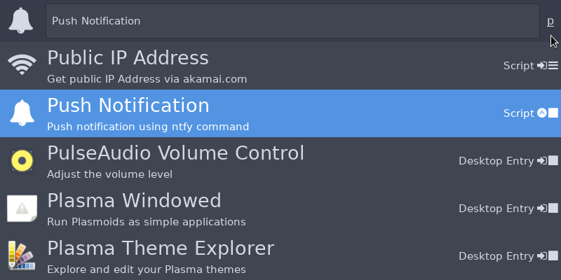
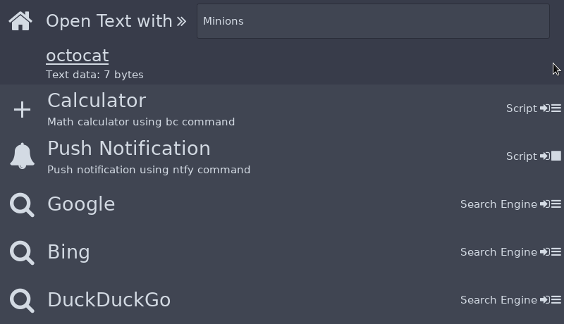
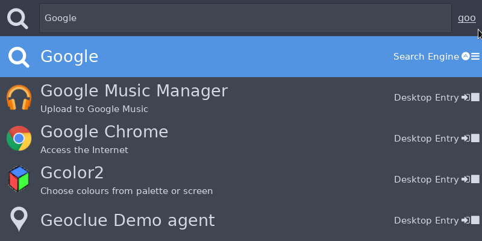
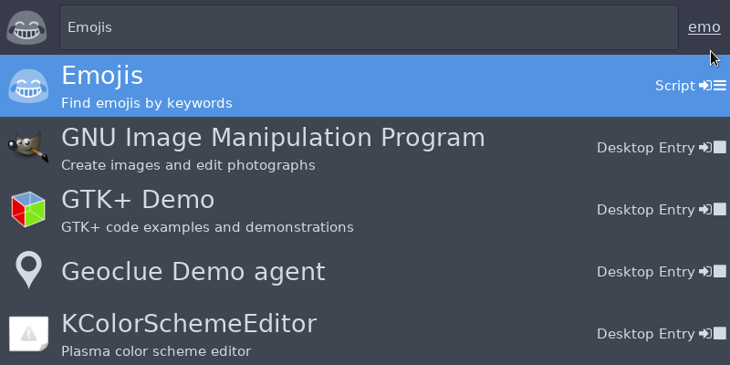
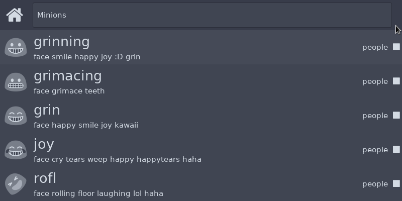
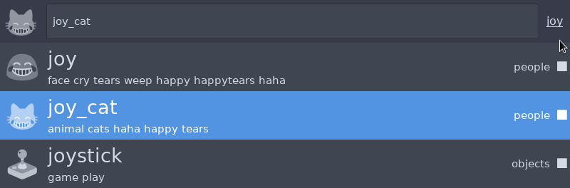
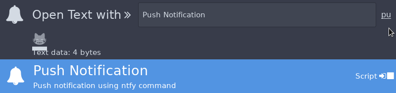
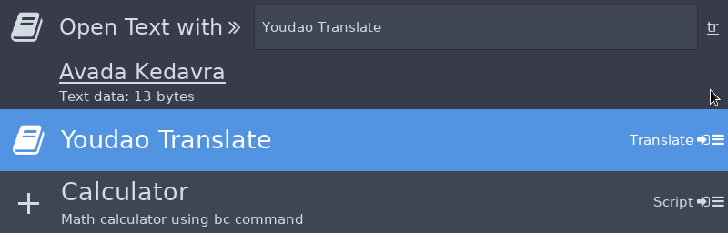
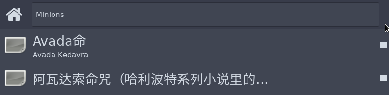

## Get it running

- Download latest AppImage from [Release](https://github.com/blahgeek/Minions/releases)
- `chmod +x ./Minions.*.AppImage`
- `./Minions.*.AppImage`

> On its first launch, Minions would need to build font cache which would take up to several minutes. (Don't worry, Minions writes its cache to `~/.minions/` and would not mess up with anything else).

Once it is started, Minions would not show any UI by default, you can bring it up using default keyboard shortcut `<ctrl>space` and `<ctrl><shift>space`, see below for more details.

## Bring it up

Hit `<ctrl>space`, the Minions would show up.

Start typing few characters (in the following image, `p`) and filtered actions would show up. The filter text would be reset to empty if you dont't type for a short period of time.

You can use `Up`/`Down`/`<ctrl>j`/`<ctrl>k` to move selections up and down.

Several actions can be done for single item:

- `<enter>`: Run the action if possible. If this action requires text input, you can then type input text.
- `<space>`: Run the action with text input, you can then type input text.
- `<tab>`: *Send* this item to other actions if possible.
- `<ctrl>c`: *Copy* this item content.

## The Quick Send

You can bring up Minions in another way named "Quick Send". If you have selected some text on your browser or any other application, or you have some text saved in the clipboard, hit `<ctrl><shift>space` would *send* the content to Minions to open with other actions, e.g., translate, search etc.

## Examples!

Note: some of the actions in the following examples requires additional commands to be installed in your system. Check [Action List](./actions.md) for more details.

- Hit `<ctrl>space` to bring it up, type `goo` to find `Google` action.

- Hit `<space>` (or `<enter>` for this action) to run the action with text input.

- Type your query and hit `<enter>`.

---

- Hit `<ctrl>space` to bring it up, type `emo` to find `Emojis` action.

- Hit `<enter>` to run this action, which would return list of all emojis with name.

- Type `joy` and `<down>` to select "joy_cat" emoji.

- Hit `<ctrl>c`, the emoji would be copied to your clipboard.
- Or better, hit `<tab>` to *send* the crying cat, and select "Push Notification" to send it to your phone.

---

- You read some words, say, "Avada Kedavra", you select it and hit `<ctrl><shift>space` to *send* it to Minions.
- Type "trans" to select "Youdao Translate" and hit "<enter>" to run.

- Avada Kedavra!

